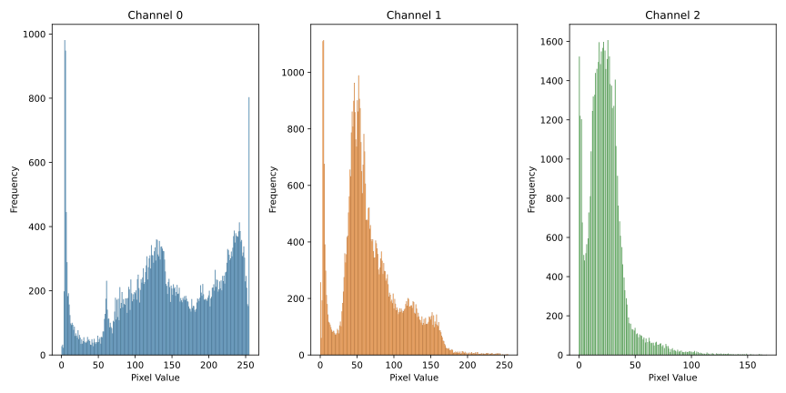
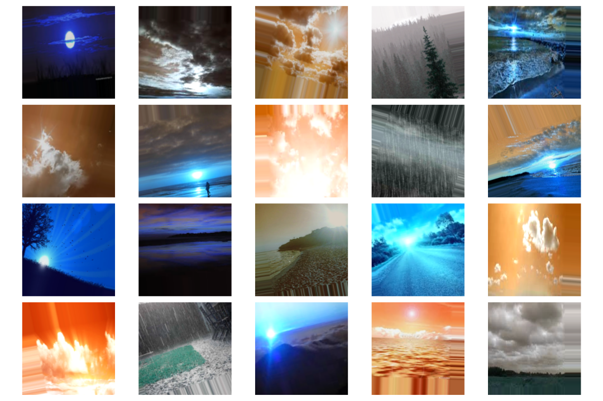

# Multi-Class Image Classification for Robust Outdoor Weather Recognition

**Authors**: [Dominic Muli](mailto:dominic.muli@student.moringaschool.com), [Evangeline Ngunjiri](mailto:evangeline.ngunjiri@student.moringaschool.com), and [Ivy Ndunge](mailto:ivy.ndunge@student.moringaschool.com)

## Project Overview
In the "Visual Weather Recognition with Deep Learning" project, the objective is to create a sophisticated Convolutional Neural Network (CNN) model capable of accurately classifying diverse weather conditions based on visual cues in images. By leveraging deep learning techniques, the project aims to develop a robust system that can distinguish between various weather phenomena, including sunny, rainy, cloudy, and sunrise scenes. The key components include the collection and exploration of a comprehensive dataset, data preprocessing with augmentation to enhance model generalization, and the design of a specialized CNN architecture. The model will be trained and evaluated, with a focus on metrics such as accuracy, precision, and recall. Visualization techniques will be employed to gain insights into the CNN's interpretation of different weather patterns, and considerations for potential deployment scenarios will be explored.

Technologies utilized in this project include Python as the primary programming language, TensorFlow for building and training the CNN and Matplotlib and Seaborn for visualization.

## Business Problem

The business objective is to leverage the multiclass weather dataset to advance the development of image classification models capable of accurately recognizing and categorizing different weather conditions. By doing so, this project aims to enhance the capabilities of outdoor weather analysis, offering valuable insights for sectors ranging from transportation and agriculture to urban planning and disaster preparedness.


## Objectives
The primary aim of this project is to develop an advanced Convolutional Neural Network (CNN) model for accurate and robust weather classification based on visual cues in images. Leveraging the power of deep learning, this project seeks to create a sophisticated system capable of distinguishing between various weather conditions, including sunny, rainy, cloudy, and sunrise scenes. The objective extends beyond mere image recognition to the creation of a model that exhibits high-level understanding of complex visual patterns associated with different weather phenomena.

* Achieve an accuracy of at least 90% in classifying outdoor weather images across various conditions.
* Develop a model that is robust to variations in lighting, camera angles, and weather intensity.
* Minimize computational resources required for model training and inference.

## Metric of Success
* Accuracy: Percentage of correctly classified weather images.
* Precision and Recall: Measures of how well the model identifies specific weather classes.
* F1-Score: Harmonic mean of precision and recall, providing a balanced measure of model performance.
* Inference Speed: Time taken to classify a single image.
* Computational Cost: Resources required to train and run the model.
* A robust and accurate multi-class image classification model for outdoor weather recognition.
* Potential applications in various sectors such as agriculture, aviation, and disaster management.

## Understanding Data

Multi-Class Image Classification of Outdoor Weather Dataset Description:

Name: Multi-class Weather Dataset for Image Classification

Size: 91.2MB

Format: Images with corresponding class labels (rain, cloudy, sunrise, shine)

Classes: 4
* Rain
* Cloudy
* Sunrise
* Shine

The data for this project is obtained from the [Mendeley Data website](https://data.mendeley.com/datasets/4drtyfjtfy/1?ref=hackernoon.com).

## Methods
The project will employ a rigorous data analysis process to understand the characteristics of the multi-class weather image dataset and prepare it for model development. Specifically, it will involve:

* Exploratory Data Analysis (EDA):
  * Analyze the distribution of images across weather classes to identify potential imbalances.
  * Explore the distribution of image sizes, resolutions, and color spaces to ensure consistency.
  * Visually analyze sample images from each class to identify key features and characteristics.
  * Employ data visualization techniques to gain insights into the data distribution and relationships between variables.
* Data Preprocessing:
  * Resizing and normalize all images to a consistent format compatible with the chosen CNN architecture.
  * Encoding class labels using one-hot encoding for multi-class classification.
  * Splitting the dataset into training, validation, and testing sets for model evaluation.
* Model Development:
  * Model Architecture:
     * Designing a multi-class image classification model using TensorFlow and Keras, considering the specific characteristics of the weather image dataset.
     * Exploring and experimenting with different CNN architectures, such as MobileNetV2, EfficientNetB3, ResNet, VGG, or Inception, to identify the most suitable architecture for this task.
     * Optimizing hyperparameters like learning rate, optimizer, and batch size to improve model performance.
  * Model Training and Evaluation:
     * Training the chosen model on the training set, monitoring its performance on the validation set to prevent overfitting.
     * Evaluating the model's performance on the unseen test set using metrics such as accuracy, precision, recall, and F1-score.
     * Analyze the results and identify areas for improvement, such as specific weather classes with lower accuracy or model bias towards certain conditions.
* Model Deployment

## EDA Before Data Pre-Processing
* Image Preview

Here, we had a look at 20 random images from the dataset


* Weather Class Distribution

Here we found that classes are relatively imbalanced


* Image Size Distribution


* Image Size Distribution


* RGB Distribution



## EDA After Data Pre-Processing

* Sample augmented Images



## Conclusions


### Recommendations


## For More Information

See the full analysis in the [Jupyter Notebook](./multiclass_image_classification_model.ipynb) or review this [presentation](./multiclass_image_classification_presentation.pdf).

For additional info, contact [Dominic Muli](mailto:dominic.muli@student.moringaschool.com), [Evangeline Ngunjiri](mailto:evangeline.ngunjiri@student.moringaschool.com), and [Ivy Ndunge](mailto:ivy.ndunge@student.moringaschool.com)

## Repository Structure
```
├── data
├── images
├── multiclass_image_classification_model.ipynb
├── multiclass_image_classification_presentation.pdf
└── README.md
```